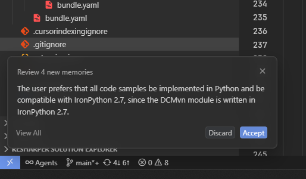
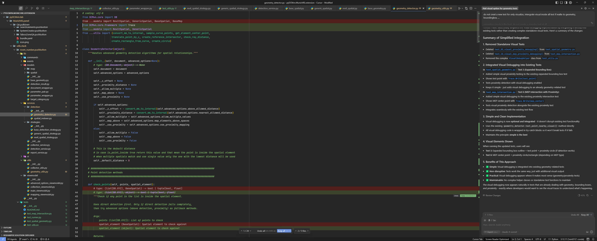
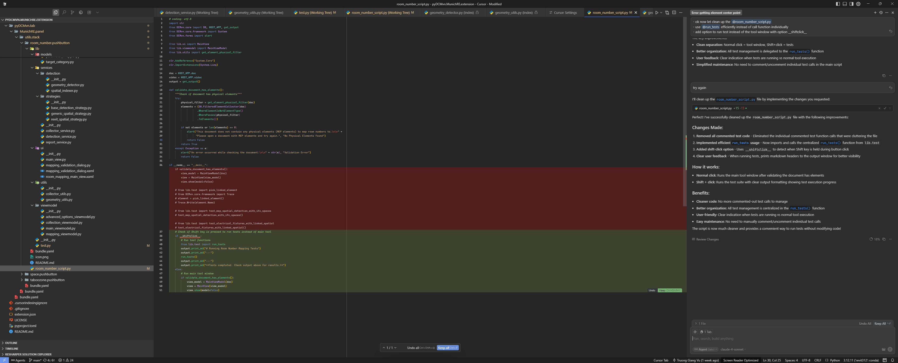
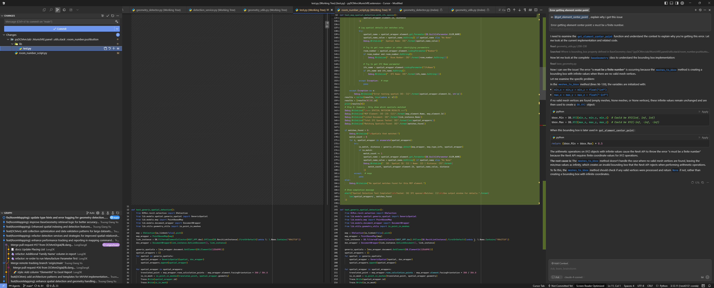

# Chat Mode for Agent Guidance

Cursor's Chat Mode transforms your development workflow by providing an intelligent conversational interface that understands your entire codebase. This feature is particularly powerful for BIM development where complex domain knowledge and multi-file operations are common.

> 🚀 **New to Cursor?** Start with the [Introduction to Cursor AI](../fundamentals/introduction-to-cursor.md) to understand the basic interface and concepts before diving into advanced Chat Mode features.

## 🌟 What is Chat Mode?

Chat Mode is Cursor's conversational AI interface that allows you to:

- Ask questions about your entire codebase
- Request complex multi-file modifications
- Get explanations of existing code patterns
- Plan and architect new features
- Debug issues with AI assistance
- Generate documentation automatically

## 🚀 Key Features for BIM Developers

### Codebase Understanding

- **Full Project Context**: AI understands your entire pyRevit extension structure
- **Cross-file Relationships**: Recognizes dependencies between modules
- **Domain Knowledge**: Understands Revit API patterns and BIM workflows
- **Historical Context**: Remembers previous conversations within a session

### Advanced Capabilities

- **Multi-file Operations**: Plan and execute changes across multiple files
- **Architectural Guidance**: Get advice on MVVM patterns and code organization
- **Testing Strategy**: Generate comprehensive test suites
- **Performance Optimization**: Identify and fix performance bottlenecks

## 💬 How to Use Chat Mode

### Basic Chat Interface

1. **Open Chat Panel**: Click the chat icon in Cursor's sidebar
2. **Reference Files**: Use `@filename` to reference specific files
3. **Reference Symbols**: Use `@ClassName` or `@function_name` for specific code elements
4. **Ask Questions**: Use natural language to describe what you need

> 💡 **New to Cursor?** Learn about the context reference system and basic interface in [Introduction to Cursor AI](../fundamentals/introduction-to-cursor.md#-cursor-interface-overview)

### Advanced Chat Commands

#### File References

```
@script.py - Reference a specific file
@models/room_processor.py - Reference file in subdirectory
@*.py - Reference all Python files
```

#### Symbol References

```
@RoomProcessor - Reference a specific class
@extract_room_data - Reference a specific function
@DB.Room - Reference external API types
```

#### Context Control

```
/clear - Clear conversation history
/docs - Include documentation in context
/web - Search web for additional context
```

## 🏗️ AEC Development Use Cases

### 1. Code Explanation and Learning

**Example Query:**

```
Can you explain how the @room_processor.py file handles Revit API transactions? 
Show me the pattern and explain why it's structured this way.
```

**Expected Response:**

- Detailed explanation of transaction patterns
- Code examples with annotations
- Best practices for Revit API usage
- Suggestions for improvements

### 2. Feature Planning and Architecture

**Example Query:**

```
I need to add Excel export functionality to my @room_analysis.py tool. 
Can you design the architecture using MVVM patterns and show me 
how to integrate it with the existing codebase?
```

**Expected Response:**

- Architectural recommendations
- Code structure proposals
- Integration strategies
- Sample implementation

### 3. Debugging and Troubleshooting

**Example Query:**

```
My @wall_analyzer.py is throwing "InvalidOperationException" when processing 
large models. Can you analyze the code and suggest performance improvements?
```

**Expected Response:**

- Code analysis and issue identification
- Performance optimization suggestions
- Memory management improvements
- Error handling enhancements

### 4. Code Generation and Refactoring

**Example Query:**

```
Convert my @room_data_extractor.py from procedural code to use proper 
MVVM pattern with WPF UI. Include error handling and progress reporting.
```

**Expected Response:**

- Complete code refactoring
- MVVM implementation
- UI integration
- Enhanced error handling

## 🎯 Effective Prompting Strategies

### Be Specific and Contextual

```
❌ "Fix my code"
✅ "Optimize the @element_collector.py to handle 10,000+ elements efficiently 
    while maintaining the existing FilteredElementCollector pattern"
```

### Include Technical Requirements

```
❌ "Add database support"
✅ "Add SQLite integration to @room_processor.py that stores room data with 
    proper indexing for area and level queries, following our existing 
    error handling patterns"
```

### Reference Existing Patterns

```
❌ "Create a new tool"
✅ "Create a new pyRevit tool similar to @existing_tool.py but for processing 
    MEP elements, following the same transaction handling and output patterns"
```

## 📊 Advanced Chat Techniques

### AI Memory and Suggestions

Cursor provides intelligent memory suggestions to help maintain context and improve your workflow:



*Cursor's memory feature suggests relevant context and previous conversations to enhance current discussions*

### Multi-Step Planning

Break complex requests into phases:

```
Phase 1: Can you analyze my current @pyrevit_extension structure and 
identify areas for improvement?

Phase 2: Based on your analysis, create a refactoring plan that maintains 
backward compatibility while improving performance.

Phase 3: Implement the first improvement focusing on the @utils module.
```

### Iterative Development

Build features incrementally:



*Preview interface showing how Cursor manages changes across multiple files during iterative development*

```
Step 1: Create a basic room data structure that matches Revit's Room element

Step 2: Add validation methods to ensure data integrity

Step 3: Include Excel export functionality with proper formatting

Step 4: Add error handling for common Revit API exceptions
```

### Code Review and Quality Assurance

Use chat for comprehensive reviews:



*Review interface showing how Cursor tracks and presents code changes for quality assurance*

```
Please review @my_new_feature.py for:
1. Adherence to our coding standards in @.cursor/rules/
2. Proper Revit API usage patterns
3. Performance implications for large models
4. Security considerations for file operations
5. Test coverage recommendations
```

## 🔧 Chat Mode Settings

### Context Management

Cursor automatically manages context for Chat Mode through its indexing and rules system. You can control what information is available to Chat Mode through:

- **Codebase Indexing**: Configured in `Cursor Settings > Features > Codebase Indexing`
- **Rules for AI**: Set project-specific rules in `.cursor/rules/` directory
- **Ignore Files**: Use `.cursorignore` to exclude sensitive files from indexing

### Privacy and Security

Control what Chat Mode can access:

- Use `.cursorignore` file to exclude sensitive files and directories
- Configure indexing settings to limit what gets processed
- Review file patterns to ensure proprietary data remains private

For detailed configuration options, refer to the [official Cursor documentation](https://docs.cursor.com/en/context/rules).

## 🚀 Integration with Other Features

### Chat + Tab Completion

Use chat to understand context, then apply with Tab:

1. Ask chat about patterns
2. Learn the approach
3. Use Tab completion to implement

### Chat + Inline Edit

Combine for powerful editing:

1. Plan changes in chat
2. Select specific code sections
3. Use inline edit with chat guidance

### Chat + Agent Mode

Escalate complex tasks:

1. Discuss approach in chat
2. Delegate implementation to Agent Mode
3. Review and refine results

:::warning Always Use Version Control with AI Agents
When working with AI agents that can make extensive code changes, **always use Git for version control** to track all modifications and maintain code history.



*Best practice: Always commit your work before starting AI agent sessions to ensure you can track and revert changes if needed*
:::

## 📈 Best Practices for BIM Development

### Domain-Specific Queries

Leverage BIM knowledge:

```
"How should I handle coordinate system transformations between linked models 
in my @coordination_tool.py?"

"What's the best approach for batch processing family parameters while 
maintaining transaction performance?"

"How can I optimize my IFC export workflow to handle large architectural models?"
```

### Performance Optimization

Get specific performance advice:

```
"Analyze @large_model_processor.py for memory leaks and suggest improvements 
for processing 50,000+ elements"

"How can I implement parallel processing for @room_analysis.py while 
respecting Revit API thread restrictions?"
```

### Integration Guidance

Ask about connecting systems:

```
"How should I integrate @revit_exporter.py with our existing database 
schema while maintaining data consistency?"

"What's the best pattern for connecting my pyRevit tools with external 
web APIs for cloud data synchronization?"
```

## 🎓 Learning and Development

### Code Learning

Use chat as a learning tool:

```
"Explain the design patterns used in @advanced_tool.py and why they're 
effective for BIM applications"

"What are the key differences between how @tool_v1.py and @tool_v2.py 
handle error scenarios?"
```

### Best Practices Discovery

Learn from your codebase:

```
"Analyze all my pyRevit tools and identify common patterns that could 
be extracted into a shared utility library"

"What coding standards are consistently followed across my project, 
and where are there inconsistencies?"
```

## 📝 Prompt Engineering for BIM Development

For advanced prompt engineering techniques specifically tailored to BIM development, see:

- [Prompt Engineering Guide](./chat-mode/prompt-engineering.md) - Comprehensive strategies for effective AI communication

---

Chat Mode is your AI pair programming partner, ready to help with everything from quick questions to complex architectural decisions. Master this feature to unlock the full potential of AI-assisted BIM development.
