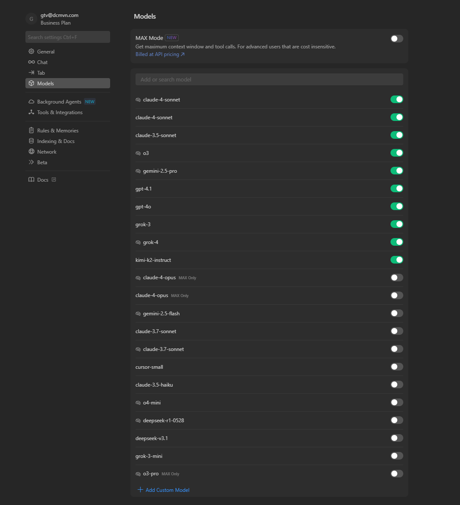
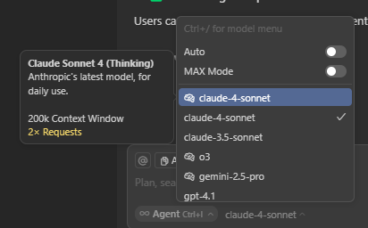
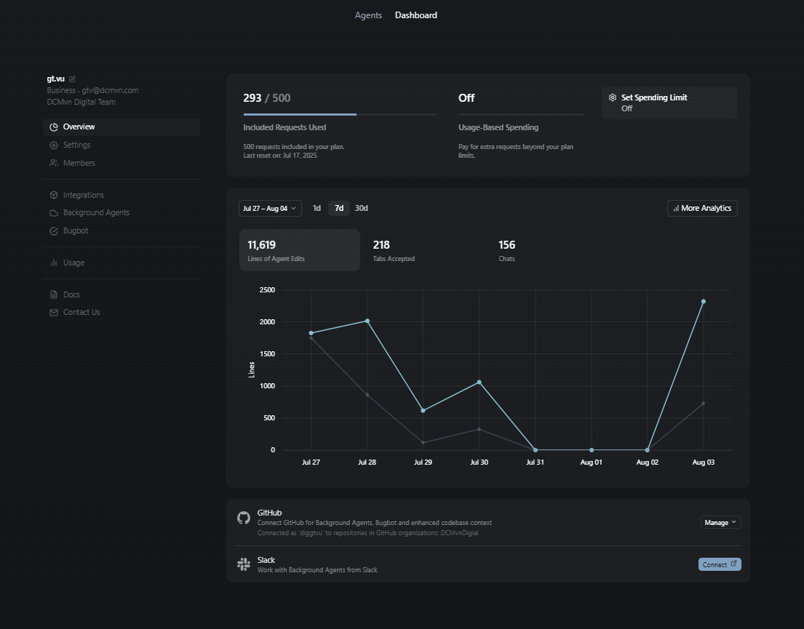
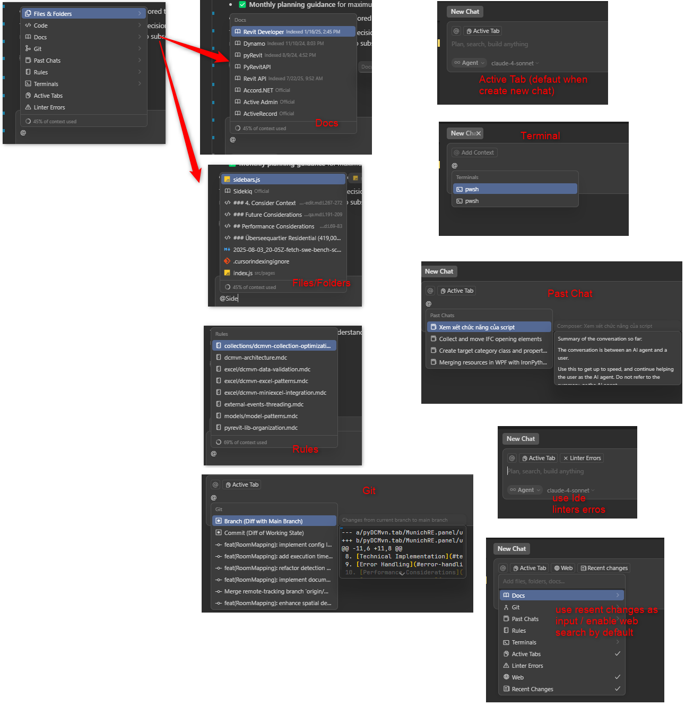

# Prompt Engineering for BIM Development

Master the art of communicating with Cursor AI to accelerate your Building Information Modeling workflows.

## Understanding Cursor's AI Capabilities

Cursor integrates multiple AI models to assist with code generation, completion, and problem-solving. Based on the [official Cursor documentation](https://docs.cursor.com/en/welcome), Cursor can:

- **Generate code** from natural language descriptions
- **Complete code** with context-aware suggestions
- **Debug issues** by understanding your codebase
- **Explain code** and provide documentation
- **Refactor code** for better performance and readability

### DCMvn Cursor Pro Subscription

At DCMvn, we have a **Cursor Pro subscription** with the following features:

- **500 premium requests per month** shared across the team
- **Multiple AI model access** with different cost structures
- **Enhanced performance** for complex BIM development tasks



*Available AI models in Cursor Pro showing different capabilities and request costs*

### Model Selection and Request Costs

Different AI models have varying request costs that impact your monthly allocation:



*Model selection interface showing cost implications for different AI models*

#### Current Model Pricing (Subject to Change):

- **Claude Sonnet 4**: **1 premium requests** per query (excellent for both daily use and complex BIM logic)
- **Claude Sonnet 4 Thinking**: **2 premium requests** per query (best for architectural understanding)
- **Claude Opus 4**: **Max Mode** (high cost) for complex advanced & detailed architecture prompt
- **Other Models**: **1 premium request** per query (standard pricing)
- **Max Mode**: **High premium request cost** - use sparingly for complex multi-file operations

:::warning Request Management
With 500 premium requests per month, plan your AI usage strategically:

- Use **Claude Sonnet 4 Thinking** for complex Revit API problems (2 requests each)
- Reserve **Max Mode** for critical architectural refactoring (high cost)
- Consider model capabilities vs. cost for routine tasks
- Monitor your request usage throughout the month
  :::

### Usage Dashboard

go to [Cursor Dashboard](https://cursor.com/dashboard)



*Cursor Dashboard provides a visual summary of how users are interacting with Cursor AI over time*

## Strategic Prompt Planning for Limited Requests

Given DCMvn's 500 premium requests per month, effective prompt engineering becomes crucial for maximizing value:

### Request Budgeting Strategy

#### High-Value Scenarios (Use Premium Models):

- **Complex Revit API architecture** - Use Claude Sonnet 4 Thinking (2 requests)
- **Multi-file refactoring** - Use Claude Sonnet 4 (1 request)
- **Advanced MVVM patterns** - Use Claude Sonnet 4 (1 request)
- **Critical debugging** - Use appropriate model based on complexity
- **Use Max Mode** (high cost, but comprehensive) when you have a complete blueprint (the most detail instruction as much as possible)

#### Medium-Value Scenarios (Standard Models):

- **Parameter extraction logic** - Use standard models (1 request)
- **Simple pyRevit tools** - Use standard models (1 request)
- **Documentation generation** - Use standard models (1 request)

#### Low-Value Scenarios (Avoid Premium):

- **Basic syntax questions** - Use ChatGPT (free)
- **Simple code completion** - Use Tab completion (free)
- **Quick clarifications** - Use ChatGPT (free)

### Monthly Planning Tips

1. **Plan complex tasks early** in the month when requests are available
2. **Batch similar queries** to maximize context efficiency
3. **Use incremental development** to refine prompts before premium submission
4. **Reserve Max Mode** for end-of-sprint architectural work
5. **Monitor usage** through Cursor's request counter

### Cursor Context Reference

[Cursor Context Reference](https://docs.cursor.com/en/context/@-symbols/overview)



*Cursor Context Reference showing the different context features available*

## Core Prompt Engineering Principles

### 1. Be Specific and Contextual

#### ❌ Vague Prompt

```
"Create a wall function"
```

#### ✅ Specific BIM Prompt

```
"Create a C# Revit API external command that collects all interior walls 
on Level 1, extracts their wall type, thickness, and fire rating parameters, 
then exports the data to Excel with proper formatting and error handling."
```

### 2. Include Technical Context

#### ❌ Generic Request

```
"Make a script to process building data"
```

#### ✅ BIM-Specific Context

```
"Create a pyRevit script that processes IfcSpaceType to extract 
space data including area, volume, and occupancy classification according 
to buildingSMART standards, then generates a compliance report for 
accessibility requirements."
```

### 3. Specify Error Handling and Edge Cases

#### ❌ Basic Request

```
"Get room areas from Revit"
```

#### ✅ Robust Request

```
"Create a Revit API function that safely extracts room areas, handling 
unplaced rooms, rooms with zero area, linked files, and design options. 
Include try-catch blocks for transaction errors and parameter access failures."
```

## BIM-Specific Prompt Patterns

### Revit API Development Prompts

#### Plugin Architecture

```
"Generate a complete Revit external command structure with:
- Proper attribute decorations for manual transactions
- Error handling with user-friendly messages
- Progress reporting for long operations
- Undo functionality
- Resource cleanup and disposal patterns"
```

#### MEP Element Collection and Filtering

```
"Create a filtered element collector that finds all duct fittings 
where the system type is 'Supply Air' and the fitting size is greater 
than 12 inches diameter, with error handling for missing parameters."
```

#### Parameter Management

```
"Build a parameter utility class that safely reads and writes Revit 
parameters with type checking, handles shared vs instance parameters, 
and includes methods for parameter creation and validation."
```

### IFC Processing Prompts (Standalone Python Scripts)

#### Schema Navigation (External Script)

```
"Create a standalone Python script using ifcopenshell that traverses the spatial 
hierarchy from IfcProject > IfcSite > IfcBuilding > IfcBuildingStorey > 
IfcSpace and extracts MEP system data according to IFC4x3 schema. 
The script should run independently without Revit."
```

#### MEP System Extraction (External Script)

```
"Develop a standalone Python function using ifcopenshell that extracts all 
HVAC system information from IFC files, including duct networks, equipment, 
and flow rates. Handle missing properties gracefully and export to Excel."
```

#### BCF Issue Processing (External Script)

```
"Build a standalone Python tool using ifcopenshell and BCF libraries that:
- Reads BCF files and extracts issue locations
- Correlates issues with IFC element GUIDs
- Generates HTML reports with issue summaries
- Runs without any CAD software dependencies"
```

### MEP Data Analysis Prompts

#### Duct Sizing Analysis

```
"Create a pyRevit script that analyzes duct sizing in the current model:
- Collects all ductwork and their flow parameters
- Identifies oversized or undersized ducts based on velocity
- Generates a simple HTML report with findings
- Exports results to Excel with color-coded recommendations"
```

#### Equipment Inventory

```
"Develop a MEP equipment inventory tool that:
- Collects all mechanical equipment in the model
- Extracts manufacturer, model, and capacity information
- Creates equipment schedules with proper formatting
- Exports to Excel with equipment photos if available"
```

## Cost-Effective Prompt Strategies

### Maximizing Value per Request

Since each premium request counts, structure your prompts to get maximum value:

#### ✅ Comprehensive Single Request

```
"Create a complete pyRevit tool for MEP duct analysis that:
1. Collects all ductwork with flow parameters
2. Calculates velocity and pressure drop
3. Identifies sizing issues with recommendations
4. Exports results to Excel with formatting
5. Includes error handling and progress reporting
6. Follows DCMvn coding standards and MVVM patterns"
```

#### ❌ Multiple Separate Requests

```
Request 1: "How do I collect duct elements?"
Request 2: "How do I get flow parameters?"
Request 3: "How do I calculate velocity?"
Request 4: "How do I export to Excel?"
Request 5: "How do I add error handling?"
```

### Batch Processing Prompts

When using premium models, combine multiple related tasks:

```
"For the MEP coordination project, provide:
1. Revit API code for clash detection between ducts and beams
2. Parameter extraction for conflict resolution
3. Report generation with clash locations and recommendations
4. Integration patterns with our existing MVVM framework
Include complete error handling and follow our project structure."
```

## Advanced Prompt Engineering Techniques

### 1. Incremental Development

Start with a basic structure and refine:

```
Step 1: "Create a basic pyRevit script that displays duct count"

Step 2: "Enhance the script to collect all ducts and their flow rates"

Step 3: "Add parameter extraction for duct system type and size"

Step 4: "Include Excel export functionality with flow analysis"

Step 5: "Add error handling and progress reporting for large systems"
```

### 2. Template-Based Prompts

Use established patterns:

```
"Using the standard Revit API transaction pattern, create a [FUNCTION] 
that [ACTION] for [ELEMENT TYPE] elements, handling [ERROR CONDITIONS] 
and providing [USER FEEDBACK]."

Example:
"Using the standard Revit API transaction pattern, create a family loader 
that batch loads structural steel families for beam elements, handling 
missing files and name conflicts and providing progress feedback to users."
```

### 3. Multi-Model Prompts

For complex scenarios:

```
"Create a federated model analysis tool that:
1. Loads architectural, structural, and MEP Revit models
2. Aligns coordinate systems using shared coordinates
3. Detects model inconsistencies across disciplines
4. Generates an interdisciplinary coordination report
5. Exports issues to BIM 360 or ACC for resolution tracking"
```

### 4. Performance-Optimized Prompts

Request efficient solutions:

```
"Optimize this Revit element collection for large models (10,000+ elements):
- Use appropriate filters before ToElements()
- Implement batch processing for parameter access
- Include memory management for large datasets
- Add cancellation tokens for user interrupt
- Implement progress reporting every 100 elements"
```

## Cursor-Specific Features for BIM

### Tab Completion Optimization

```
// Start typing common BIM patterns and let Tab complete:
FilteredElementCollector collector = new // Tab suggests complete pattern
using (Transaction trans = new // Tab provides transaction boilerplate
if (element.get_Parameter( // Tab suggests common parameters
```

### AI Chat Integration

Use the AI chat for complex questions:

```
"How do I handle circular references when traversing MEP system connections?"

"What's the most efficient way to update 1000+ family parameters in Revit?"

"Explain the difference between IfcSpace and IfcZone in IFC4 schema"
```

### Codebase Understanding

Leverage Cursor's project awareness:

```
"Based on my existing ElementUtils class, create a similar utility for 
handling MEP elements that follows the same patterns and error handling."

"Update all my Revit commands to use the new logging framework I've 
implemented in the Logger.cs file."
```

## Testing and Validation Prompts

### Standalone Testing

```
"Create a standalone Python test script that validates MEP data processing logic:
- Use sample dictionaries to simulate duct data
- Test flow rate calculations without Revit dependencies
- Include edge cases like zero flow and missing parameters
- Generate test reports that can run on any Python environment"
```

### Code Review

```
"Review this Revit API code for:
- Memory leaks and proper disposal patterns
- Thread safety issues
- Performance bottlenecks
- Compliance with Autodesk API best practices
- Error handling completeness"
```

## Common Development Scenarios

### Simple HTML Reports

```
"Create a pyRevit tool that generates simple HTML reports:
- Collects MEP equipment data from the model
- Creates formatted HTML tables with equipment information
- Includes basic styling with embedded CSS
- Show reports to user within Id linkify using pyRevit ouput window"
```

### Excel Data Operations

```
"Build a pyRevit utility for Excel data operations:
- Read MEP equipment specifications from Excel files
- Update Revit element parameters based on Excel data
- Export duct analysis results to formatted Excel sheets
- Handle Excel file locking and error conditions gracefully"
```

### SQLite Database Integration

```
"Design a simple database integration tool:
- Create SQLite database for storing MEP system data
- Insert duct and equipment information from Revit models
- Query database for reports and analysis
- Export query results to Excel or CSV formats"
```

## Best Practices Summary

### Technical Requirements

1. **Always specify the context** (Revit API, IFC, MEP, etc.)
2. **Include error handling requirements** in your prompts
3. **Request specific output formats** (Excel, PDF, IFC, etc.)
4. **Mention performance considerations** for large models
5. **Ask for documentation and comments** in generated code
6. **Specify user experience requirements** (progress bars, messages)
7. **Include compliance requirements** (building codes, standards)
8. **Request test scenarios** for quality assurance

### Cost Management (DCMvn Specific)

9. **Plan premium requests strategically** - batch related queries
10. **Use comprehensive prompts** - get maximum value per request
11. **Use Claude Sonnet 4 at daily use** - use Claude Sonnet 4 for daily use, it's strong in both daily use and complex BIM logic (consider Gpt-4o for basic questions with more context window size)
12. **Consider Claude Sonnet 4 Thinking** (2 requests) for complex BIM logic with advanced architecture
13. **Monitor monthly usage** - track requests through Cursor interface
14. **Reserve Max Mode** for critical architectural work only (high cost, you may loose all 500 premium requests with few questions)
15. **Use free features first** - Tab completion, ChatGpt for prompt engineering suggestions

## Resources

- **[Cursor Documentation](https://docs.cursor.com/en/welcome)** - Official Cursor features and capabilities
- **[Revit API Documentation](https://revapidocs.com/)** - Autodesk Revit API documentation
- **[Autodesk Revit Developer Guide](https://help.autodesk.com/view/RVT/2025/ENU/?guid=Revit_API_Revit_API_Developers_Guide_html)** - Autodesk Revit Developer Guide
- **[ifcopenshell Documentation](https://docs.ifcopenshell.org/)** - IfcOpenShell documentation for IFC processing
- **[pyRevit Documentation](https://pyrevitlabs.notion.site/Developer-Docs-2c88f3ecccde422d9504e20b6b9e04f8)** - pyRevit Developer Docs

---

*Prompt engineering guide focusing on Cursor AI capabilities for professional BIM development*
