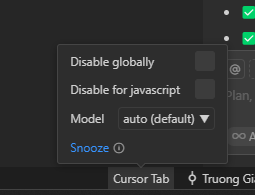
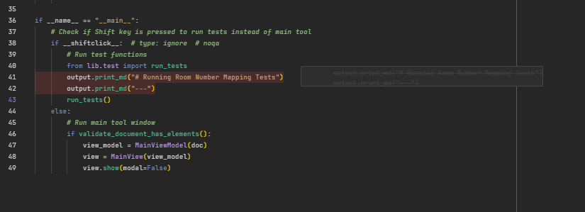

# Best Tab Autocomplete Ever !!!

Cursor's Tab feature provides autocompletion with multi-line edits, cross-file suggestions, and context-aware code completions specifically optimized for BIM development workflows.

> 📚 **Prerequisites**: Familiarize yourself with [Cursor basics](../fundamentals/introduction-to-cursor.md) and [initial setup](../fundamentals/setting-up-cursor.md) before exploring advanced Tab features.

## What is Cursor Tab?

Tab is a specialized Cursor model for autocompletion that learns from your usage patterns. According to the [official Cursor documentation](https://docs.cursor.com/en/tab/overview), the more you use it, the better it becomes as you inject intent by accepting Tab or rejecting Esc suggestions.

### Core Capabilities

With Cursor Tab, you can:

- **Modify multiple lines at once** - Generate complete code blocks
- **Add import statements when missing** - Automatic dependency management
- **Jump within and across files** for coordinated edits
- **Get suggestions based on recent changes** - Context-aware completions

## How Tab Works for BIM Development

### Intelligent Suggestions

When adding text, completions appear as semi-opaque ghost text. When modifying existing code, it shows as a diff popup right of your current line.

**For pyRevit development:**

```python
# Type: "def get_all_rooms" + Tab
def get_all_rooms():
    """Get all rooms in the active document"""
    doc = revit.doc
    rooms = DB.FilteredElementCollector(doc)\
        .OfCategory(DB.BuiltInCategory.OST_Rooms)\
        .WhereElementIsNotElementType()\
        .ToElements()
    return rooms
```

### Navigation Features

#### Jump in File

Tab predicts your next editing location in the file and suggests jumps. After accepting an edit, press Tab again to jump to the next location.

#### Jump Across Files

Tab predicts context-aware edits across files. A portal window appears at the bottom when a cross-file jump is suggested - particularly useful for pyRevit projects with multiple modules.

### Auto-Import for BIM Libraries

In Python projects, Tab automatically adds import statements when missing. This is especially powerful for BIM development:

```python
# Type a Revit API method
geometry = element.get_Geometry()

# Tab automatically suggests and adds:
from Autodesk.Revit.DB import GeometryElement
```

**Requirements for auto-import:**

- Ensure your project has the right language server extensions
- Test with Ctrl+. to check if imports appear in Quick Fix suggestions

## Advanced Features

### Tab in Peek Views

Tab works in "Go to Definition" or "Go to Type Definition" peek views, making it useful for modifying function signatures and fixing call sites across your pyRevit project.

### Partial Accepts

Accept suggestions word-by-word using **Ctrl+Arrow-Right**, or customize the keybinding via `editor.action.inlineSuggest.acceptNextWord`. Enable this feature in: `Cursor Settings` → `Tab`.

### BIM Development Example

```python
# Start typing a pyRevit tool structure
from pyrevit import forms, revit, DB
from pyrevit.framework import List

# Tab suggests the complete tool template
__title__ = "MEP Analysis Tool"
__author__ = "Your Name"

def analyze_mep_systems():
    """Analyze MEP systems in the active document"""
    doc = revit.doc
  
    # Tab continues with intelligent MEP-specific suggestions
    mep_elements = DB.FilteredElementCollector(doc)\
        .OfCategory(DB.BuiltInCategory.OST_DuctCurves)\
        .WhereElementIsNotElementType()\
        .ToElements()
  
    return mep_elements
```

## Tab Settings and Configuration



*Cursor Tab autocompletion settings interface showing configuration options for intelligent code completion*

> 🔧 **Settings Overview**: For a comprehensive guide to Cursor settings, see [Setting Up Cursor](../fundamentals/setting-up-cursor.md#settings)

### Available Settings

| Setting                                 | Description                                                                    |
| --------------------------------------- | ------------------------------------------------------------------------------ |
| **Cursor Tab**                    | Context-aware, multi-line suggestions around your cursor based on recent edits |
| **Partial Accepts**               | Accept the next word of a suggestion via Ctrl+Arrow-Right                      |
| **Suggestions While Commenting**  | Enable Tab inside comment blocks                                               |
| **Whitespace-Only Suggestions**   | Allow edits affecting only formatting                                          |
| **Imports**                       | Enable auto-import for TypeScript                                              |
| **Auto Import for Python (beta)** | Enable auto-import for Python projects                                         |

### Toggle Controls

Use the status bar (bottom-right) to:

- **Snooze**: Temporarily disable Tab for a chosen duration
- **Disable globally**: Disable Tab for all files
- **Disable for extensions**: Disable Tab for specific file extensions (e.g., markdown or JSON)



*Tab interface showing delete and toggle controls for managing autocompletion behavior*

### Keyboard Shortcuts

You can customize Tab behavior:

- **Tab**: Accept suggestions (default)
- **Esc**: Reject suggestions
- **Ctrl+Arrow-Right**: Accept word-by-word
- Remap these in `Keyboard Shortcuts` settings under `Accept Cursor Tab Suggestions`

## Frequently Asked Questions

### Tab gets in the way when writing comments, what can I do?

Disable Tab for comments by going to `Cursor Settings` → `Tab Completion` and unchecking **Trigger in comments**.

### Can I change the keyboard shortcut for Tab suggestions?

Yes, remap accepting and rejecting suggestions to any key using `Accept Cursor Tab Suggestions` in `Keyboard Shortcuts` settings.

### How does Tab generate suggestions?

According to the [Cursor documentation](https://docs.cursor.com/en/tab/overview), Cursor includes a small part of relevant code in the context window. The context is encrypted and sent to Cursor's backend, which securely processes it and returns intelligent suggestions based on the specialized Tab model.

## BIM Development Benefits

### Enhanced pyRevit Workflow

- **Multi-line completions** for complex pyRevit tool structures
- **Revit API awareness** for proper parameter handling and element collection
- **Cross-file intelligence** for coordinated changes across pyRevit modules

### Performance Advantages

- **Context learning** from your BIM development patterns
- **Smart imports** for Revit API namespaces
- **Error prevention** through intelligent code suggestions

### Team Collaboration

- **Consistent suggestions** based on project context
- **Learning from accepted edits** to improve future suggestions
- **Cross-file coordination** for large pyRevit extensions

---

Ready to enhance your BIM development workflow? Enable Tab autocompletion and experience intelligent code generation tailored for pyRevit and Revit API development.

*Learn more about Cursor Tab at the [official documentation](https://docs.cursor.com/en/tab/overview)*
