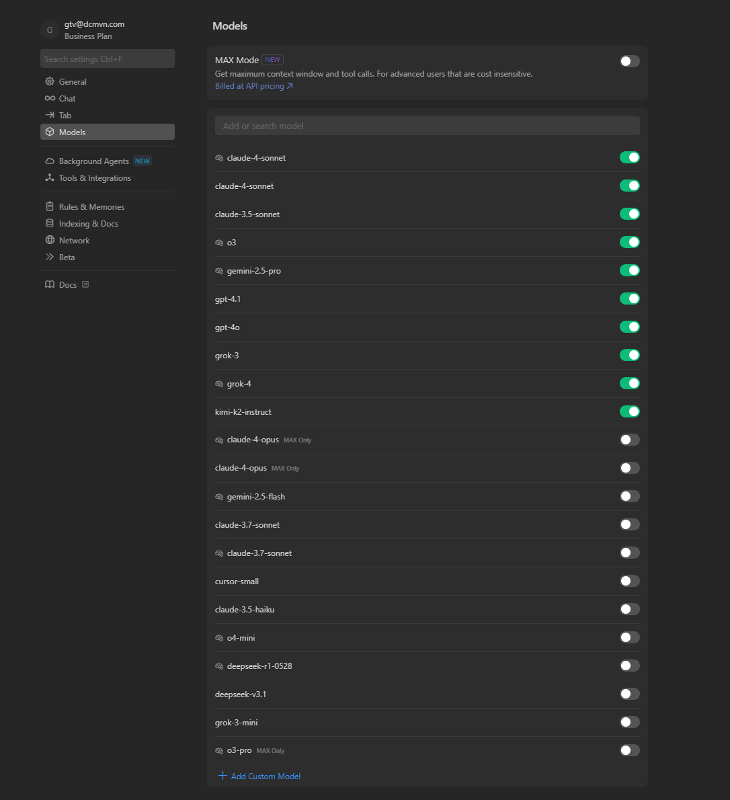
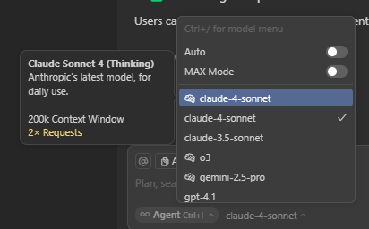

# Most Powerful LLMs for Coding Agents

A comprehensive analysis of the leading Large Language Models (LLMs) for software engineering and coding agentic workflows, based on the latest SWE-bench ecosystem and real-world performance data from late 2025.

## Executive Summary

As we cruise into late 2025, the landscape of AI coding agents has undergone a revolutionary transformation. SWE-bench has evolved from a static dataset into a dynamic suite of tests and toolkits driving the current **"Generation 3" AI coding boom**. Benchmark scores have jumped from less than 5% in 2023 to **approximately 70% resolution rates** for leading agents in mid-2025, with new evaluation frameworks like UTBoost, PolyBench, and SWE-Rebench providing more rigorous and contamination-free assessment.

:::info Latest Data Sources (Late 2025)
This analysis is based on Stanford HAI's 2025 AI Index Report, the evolved SWE-bench ecosystem, UTBoost rigorous evaluation, SWE-PolyBench multilingual benchmarks, SWE-Rebench continuous updates, and comprehensive industry reports from late 2025.
:::

## The New Benchmark Landscape

### SWE-Bench Evolution Timeline

| Date                     | Benchmark/Tool     | Innovation                                                           |
| ------------------------ | ------------------ | -------------------------------------------------------------------- |
| **Aug 2024**       | SWE-Bench Verified | 500 engineer-confirmed fixes, cleaned evaluation                     |
| **Q1-Q2 2025**     | SWE-PolyBench      | Amazon's multilingual evaluation (Java, JS, TS, Python)              |
| **Spring 2025**    | UTBoost            | Enhanced test-case generation, high-precision patch filtering        |
| **May 2025**       | SWE-Rebench        | Continuous updates, contamination tracking, standardized scaffolding |
| **June-July 2025** | SWE-Bench-CL       | Continual learning version with evolving GitHub issue streams        |

## Current Champions (Late 2025)

### 🔒 Closed-Weight Leaders

#### 1. **Claude Opus 4** - The New Coding Crown (May 2025)

- **SWE-bench Verified Score**: **72.5%** (Anthropic) | **72%** (Aider independent)
- **Terminal-bench Score**: **43.2%** (50.0% high-compute)
- **Breakthrough Feature**: Can code autonomously for **7+ hours straight**
- **Strengths**:
  - World's best coding model according to benchmarks
  - Exceptional long-term focus and context retention
  - Hybrid reasoning (instant + extended thinking modes)
  - Superior architectural understanding for complex refactors
- **Best For**: Complex enterprise development, multi-hour coding sessions, architectural rewrites
- **Availability**: Anthropic API, Amazon Bedrock, Google Cloud Vertex AI, GitHub Copilot

#### 2. **Claude Sonnet 4** - High-Performance Workhorse (May 2025)

- **SWE-bench Verified Score**: **72.7%** (slightly higher than Opus 4)
- **Key Advantage**: 8x less reward hacking vs Claude 3.7
- **Strengths**:
  - Excellent precision and instruction following
  - Optimal balance of intelligence, cost, and speed
  - 25% fewer errors, 40% faster overall (Lovable reports)
  - Powers GitHub Copilot's new coding agent
- **Best For**: High-volume development, real-time coding assistance, enterprise scale
- **Availability**: Anthropic API, GitHub Copilot (public preview), free tier access

#### 3. **NVIDIA Nemotron-CORTEXA** - Cost-Effective Powerhouse

- **SWE-bench Verified Score**: **68.2%**
- **Cost**: approximately $3.3 per task (extremely cost-effective)
- **Strengths**: Smart localization, patch diversity pipelines
- **Best For**: Budget-conscious organizations, high-volume processing
- **Availability**: NVIDIA API platforms

### 🔓 Open-Weight Champions

#### 1. **DeepSWE (Qwen3-32B + RL training)** - Open-Source Leader

- **SWE-bench Verified Score**: **59%**
- **Pass@1**: **42.2%**
- **Significance**: Top open-weight model, RL-trained specifically for coding
- **Best For**: Organizations requiring open-source solutions, custom fine-tuning
- **Availability**: Together AI, Hugging Face

#### 2. **QwQ-32B-Preview** - Reasoning Specialist

- **SWE-bench Verified Score**: **79.02-79.27%** (note: different evaluation methodology)
- **Unique Feature**: Chain-of-thought reasoning without explicit prompting
- **Best For**: Local deployment, privacy-conscious development
- **Availability**: Hugging Face, local deployment

## The Benchmark Revolution: Why SWE-Bench Still Dominates

### Key Improvements in Late 2025

1. **Grounded in Real Repositories**: GitHub issues + actual PRs = meaningful fixes, not toy problems
2. **Better Scoring Quality**: UTBoost catches fake solutions that pass tests but don't fix problems
3. **Cross-Tool Reproducibility**: SWE-Rebench ensures consistent scoring across different scaffolding
4. **Adaptability**: SWE-Bench-CL simulates evolving codebases for real-world agent testing

### Current Limitations (Still Present)

- **Complex Architectural Tasks**: Most agents still struggle with DB schema changes, concurrency bugs, architectural rewrites
- **Language Bias**: SWE-PolyBench shows agents perform best in JavaScript/Python, struggle with complex TypeScript/Java
- **Security Blind Spots**: approximately 45% of AI-generated code contains OWASP vulnerabilities (SQLi, XSS)
- **Trust Gap**: 46% of developers distrust AI code accuracy; 45% waste time debugging AI output

## Generation 3 AI Coding Tools (Mid-2025)

We've entered the era where agents aren't just code-completion tools, but integrate into the **entire SDLC**—backlog creation, branch generation, testing, documentation, and deployment pipelines. Companies like Zencoder, Copilot DevOps, and Claude Code agents are embedding this full-lifecycle approach.

### Three Generations of AI Coding Evolution

| Generation      | Era       | Capability                                         | Examples                              |
| --------------- | --------- | -------------------------------------------------- | ------------------------------------- |
| **Gen 1** | 2020-2022 | Code completion, syntax help                       | GitHub Copilot, TabNine               |
| **Gen 2** | 2023-2024 | Conversational coding, debugging                   | ChatGPT Code Interpreter, Claude 3    |
| **Gen 3** | 2025+     | **Full SDLC integration, autonomous agents** | Claude Code, GitHub Copilot Workspace |

### Key Features of Generation 3 Tools

- **Autonomous Multi-Hour Sessions**: Like Claude Opus 4's 7-hour coding marathons
- **Full Repository Understanding**: Context across entire codebases
- **CI/CD Integration**: Automatic PR handling, deployment assistance
- **Memory Persistence**: Remembering project context across sessions
- **Tool Orchestration**: Seamless integration with development tools

## 📚 Available Models in Cursor

According to the [official Cursor documentation](https://docs.cursor.com/en/models), Cursor supports all frontier coding models from major providers:

### Supported Model Providers

- **OpenAI** - GPT models including GPT-4 variants
- **Anthropic** - Claude models including Sonnet and Opus
- **Google** - Gemini models including 2.5 Flash and Pro
- **DeepSeek** - Advanced reasoning models
- **xAI** - Grok models with large context windows
- **Cursor** - Proprietary models optimized for coding

## 🧠 Understanding Context Windows

### What are Context Windows?

Based on the [official documentation](https://docs.cursor.com/en/models), a **context window** is the maximum span of tokens (text and code) an LLM can consider at once, including both:

- **Input prompt** - Your code, files, and instructions
- **Output generated** - The model's response

### How Context Works in Cursor

- **Per-Chat Context**: Each chat in Cursor maintains its own context window
- **Growing Context**: More prompts, attached files, and responses increase context size
- **Token-Based**: Context measured in tokens (~4 characters = 1 token)
- **Default Limit**: Cursor normally uses 200k tokens (~15,000 lines of code)

### Context Management Best Practices

For BIM development with large Revit projects:

```
✅ Efficient Context Usage:
- Reference specific files with @filename.py
- Use targeted questions about specific functions
- Break large tasks into smaller chunks
- Clear context when switching topics (/clear)

❌ Context Waste:
- Including entire large codebases unnecessarily
- Vague questions without file references
- Long conversation threads without focus
```

## 🚀 Max Mode - Extended Context

### What is Max Mode?

According to the [official Cursor documentation](https://docs.cursor.com/en/models), **Max Mode** extends the context window to the maximum available for each model:

- **Normal Mode**: 200k tokens (~15,000 lines of code)
- **Max Mode**: Uses each model's full context window capacity
- **Trade-offs**: Slower performance and higher cost
- **Best Models for Max Mode**: Gemini 2.5 Flash, Gemini 2.5 Pro, GPT-4.1, and Grok 4

### When to Use Max Mode

**✅ Ideal for Max Mode:**
- Large codebase analysis
- Complex architectural refactoring across multiple files
- Comprehensive documentation generation
- Cross-referencing large implementations

**❌ Avoid Max Mode for:**
- Simple code completion
- Quick questions about specific functions
- Iterative development with frequent changes
- Cost-sensitive environments

## 🤖 Auto Mode - Intelligent Model Selection

### How Auto Mode Works

Based on the [official documentation](https://docs.cursor.com/en/models), **Auto Mode** configures Cursor to:

- **Automatically select** the premium model best fit for each task
- **Optimize reliability** based on current demand
- **Detect degraded performance** and switch models automatically
- **Balance** speed, cost, and quality for each request

### Auto Mode Benefits

- **No manual selection** - Cursor chooses the optimal model
- **Reliability optimization** - Automatic fallback when models underperform  
- **Task-appropriate selection** - Different models for different complexity levels
- **Current demand awareness** - Adapts to model availability and performance

### Auto Mode Selection Examples

Auto Mode automatically selects appropriate models:

- **Simple queries** → Fast, efficient model
- **Complex architecture** → Powerful model  
- **Code generation** → Balanced model

## Performance Analysis by Use Case (Late 2025)

### Enterprise Development (Fortune 500)

**Top Recommendation**: **Claude Opus 4**

- Record 72.5% SWE-bench performance
- 7+ hour autonomous coding sessions
- Enterprise-grade reliability and safety (ASL-3 protocols)
- **Example**: Rakuten used Opus 4 for a 7-hour open-source refactor

**Alternative**: **Claude Sonnet 4**

- High performance (72.7% SWE-bench)
- Better cost-effectiveness
- GitHub Copilot integration

### Cost-Conscious Development (Startups, SMEs)

**Top Recommendation**: **NVIDIA Nemotron-CORTEXA**

- Strong performance (68.2% SWE-bench)
- Exceptional cost-effectiveness (approximately $3.3/task)
- Smart localization capabilities

**Alternative**: **DeepSWE (Open-Source)**

- 59% SWE-bench score (best open-weight)
- Zero API costs after deployment
- Customizable and fine-tunable

### Privacy-First Development (Government, Healthcare)

**Top Recommendation**: **DeepSWE + Custom Infrastructure**

- Complete control over data and model
- RL-trained specifically for coding tasks
- No external API dependencies

**Alternative**: **QwQ-32B-Preview**

- Strong reasoning capabilities
- Local deployment on consumer hardware
- Chain-of-thought without explicit prompting

### Research and Experimentation (Academic, R&D)

**Top Recommendation**: **Claude Opus 4**

- Cutting-edge reasoning capabilities
- Extended thinking mode for complex problems
- Superior performance on novel challenges

**Alternative**: **Claude Sonnet 4 with Extended Thinking**

- Available even on free tier
- Strong reasoning capabilities
- Good balance of cost and performance

## For BIM/AEC Domain Development

:::tip Domain-Specific Recommendation
For BIM and AEC development (Revit plugins, spatial-index services, custom exporters), consider building your own **PolyBench-style subset** combined with UTBoost validation and SWE-Rebench tracking. This prevents overfitting from open-source training data and ensures domain-specific accuracy.
:::

### Recommended Approach for AEC Development

1. **Use Claude Opus 4** for complex architectural problems
2. **Build custom evaluation sets** for Revit API, Python-C# interop
3. **Integrate vulnerability scanning** alongside performance metrics
4. **Include quality audits** (documentation, modularity, memory consumption)



*Available AI models in Cursor showing different capabilities and their performance characteristics*



*Model selection interface in Cursor for choosing the appropriate AI model for your development tasks*

### Usage Monitoring and Dashboard

Track your AI model usage and performance with Cursor's built-in monitoring:


*Cursor Usage Dashboard provides insights into your AI interactions and helps optimize model selection for different tasks*

## 🔧 Model Hosting and Privacy

According to the [official Cursor documentation](https://docs.cursor.com/en/models):

- **US-based infrastructure** by the model's provider, trusted partner, or Cursor directly
- **Privacy Mode**: When enabled, neither Cursor nor providers store your data
- **Data deletion**: All data is deleted after each request in Privacy Mode
- **Security details**: Available in Cursor's Privacy, Privacy Policy, and Security pages

## Implementation Guide for Late 2025

### Quick Start Recommendations

**For Most Organizations**: Start with **Claude Sonnet 4**

- Available on free tier for testing
- 72.7% SWE-bench performance
- GitHub Copilot integration
- Excellent cost-performance balance

**For Complex Projects**: Upgrade to **Claude Opus 4**

- Record 72.5% SWE-bench performance
- 7+ hour autonomous sessions
- Best for architectural challenges

**For Budget-Conscious Teams**: Consider **Nemotron-CORTEXA**

- 68.2% performance at approximately $3.3/task
- Excellent cost-effectiveness

**For Privacy/Local Deployment**: Deploy **DeepSWE**

- Best open-source option (59% SWE-bench)
- Full control over data and infrastructure

### Integration Strategies for Generation 3

1. **Full SDLC Integration**: Deploy agents across entire development lifecycle
2. **Memory Persistence**: Implement context retention across sessions
3. **Tool Orchestration**: Connect with existing development tools
4. **Security-First**: Include vulnerability scanning and quality audits
5. **Continuous Evaluation**: Regular benchmarking with domain-specific tests

### Critical Success Factors

- **Trust Building**: Address the 46% developer trust gap through gradual adoption
- **Security Vigilance**: 45% of AI code contains vulnerabilities—implement scanning
- **Domain Specialization**: Build custom evaluation sets for your specific domain
- **Multi-Modal Approach**: Use different models for different complexity levels

## 📊 Token Management

**What are Tokens:**
- **1 token ≈ 4 characters** or ~0.75 words
- **200k tokens ≈ 15,000 lines** of code (normal mode)
- **Max Mode** varies by model (up to 2M+ tokens for some models)

## The Road Ahead (Late 2025 and Beyond)

### Immediate Trends

- **Generation 3 AI tools** becoming mainstream
- **Autonomous multi-hour sessions** becoming standard
- **Full SDLC integration** replacing point solutions
- **Open-source models** catching up to closed-source performance

### What to Watch

- **Claude Opus 4 adoption** in enterprise environments
- **GitHub Copilot Workspace** with Claude Sonnet 4 integration
- **DeepSWE improvements** and new RL-trained models
- **Domain-specific fine-tuning** for specialized industries

### Strategic Implications

The era of simple code completion is over. We've entered the age of **autonomous AI developers** that can work for hours, understand entire codebases, and integrate across the full software development lifecycle. Organizations that adapt quickly to this Generation 3 paradigm will gain significant competitive advantages.

## Conclusion

Late 2025 marks a watershed moment in AI-assisted software development. With **Claude Opus 4** achieving 72.5% on SWE-bench and demonstrating 7-hour autonomous coding capabilities, we're witnessing the emergence of truly agentic AI developers. The combination of improved benchmarks (UTBoost, SWE-PolyBench, SWE-Rebench), Generation 3 tooling, and open-source alternatives like DeepSWE creates an unprecedented landscape of possibilities.

The choice of AI coding tools now requires careful consideration of use case, security requirements, cost constraints, and integration complexity. As these tools become more powerful and autonomous, organizations must balance the tremendous productivity gains with appropriate governance, security measures, and trust-building strategies.

---

*Analysis based on comprehensive data from late 2025 sources including Stanford HAI 2025 AI Index Report, official SWE-bench ecosystem updates, and extensive industry reporting. The field evolves rapidly—continuous evaluation remains essential.*

## Data Sources (Late 2025)

- [Stanford HAI 2025 AI Index Report](https://hai.stanford.edu/ai-index/2025-ai-index-report/)
- [Livebench](https://livebench.ai/#/)
- [SWE-bench Ecosystem](https://www.swebench.com/)
- [UTBoost Rigorous Evaluation](https://arxiv.org/abs/2506.09289)
- [SWE-PolyBench Multilingual](https://arxiv.org/abs/2504.08703)
- [SWE-Rebench Continuous Updates](https://nebius.com/blog/posts/introducing-swe-rebench)
- [Anthropic Claude 4 Reports](https://venturebeat.com/ai/anthropic-claude-opus-4-can-code-for-7-hours-straight/)
- [TechRadar Generation 3 Analysis](https://www.techradar.com/pro/the-three-generations-of-ai-coding-tools/)
- [NVIDIA Nemotron-CORTEXA](https://research.nvidia.com/labs/adlr/cortexa/)
- [Together AI DeepSWE](https://kiadev.net/news/2025-07-03-together-ai-deepswe-open-source-rl-coding-agent-swenbench/)

## 📚 Additional Resources

- [Cursor Models Documentation](https://docs.cursor.com/en/models) - Complete guide to available models
- [Cursor Context Management](https://docs.cursor.com/en/context/) - Working with context in Cursor
- [Cursor Privacy & Security](https://docs.cursor.com/privacy) - Privacy policies and security details

### Next Steps

1. **[Setting Up Cursor](./setting-up-cursor.md)** - Configure Cursor for your development environment
2. **[Project Setup](./project-setup.md)** - Set up your development workspace
3. **[Chat Mode](../features/chat-mode.md)** - Learn how to use Chat Mode effectively
4. **[Prompt Engineering](../features/chat-mode/prompt-engineering.md)** - Advanced techniques for better results
