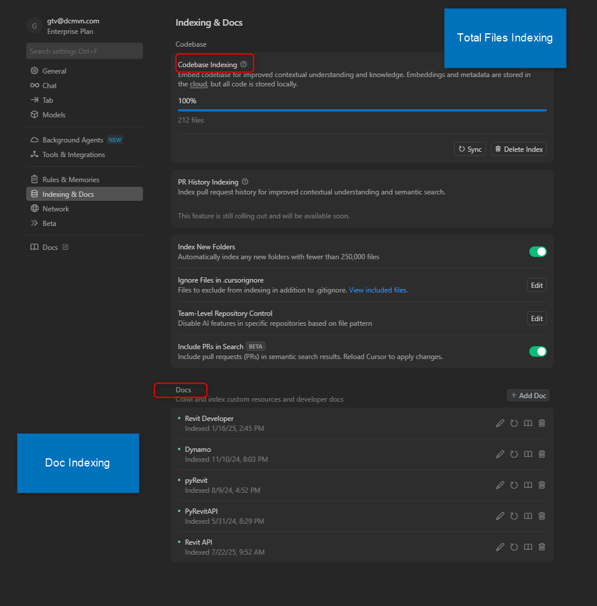

# Project Setup

Configure your BIM development environment for optimal Cursor AI integration. This guide assumes you have already [set up Cursor](./setting-up-cursor.md) with the necessary prerequisites.

## Project Structure Recommendations

For optimal Cursor performance with BIM projects, organize your workspace as follows:

- [C# Revit Project](https://github.com/DCMvnDigial/DCMvn)
- [Python pyRevit Project](https://github.com/DCMvnDigial/pyDCMvn.MunichRE)
- [IFC Analysis Project](https://github.com/DCMvnDigial/IfcAnalyzer)

## Configure Cursor Indexing

### Codebase Indexing and Documentation

Cursor automatically indexes your codebase to provide intelligent AI assistance:



*Cursor's indexing and documentation features help provide better context for AI assistance by understanding your codebase structure*

### Control File Access and Indexing

Cursor provides two ignore files to control what the AI can access and index:

**`.cursorignore`** - Blocks access to files from:

- Codebase indexing
- Tab, Agent, and Inline Edit features
- @ symbol references

**`.cursorindexingignore`** - Excludes files from indexing only (files remain accessible to AI features but won't appear in codebase searches)

For BIM projects, use these patterns to optimize performance:

**.cursorignore example:**

```gitignore
# Block access to large BIM files completely
*.rvt
*.rfa
*.rte
*.rft
*.ifc
*.dwg

# Block access to sensitive files
config.json
secrets/
*.key
*.pem
.env*

# Block access to temporary files
temp/
**/*.tmp
**/*.bak
```

**.cursorindexingignore example:**

```gitignore
# Don't index but allow AI access when referenced
docs/archive/
legacy/
**/*.pdf
**/*.xlsx
large_datasets/

# Don't index build outputs
bin/
obj/
dist/
node_modules/
```

## Configure Version Control

### .gitignore for BIM Projects

Create a `.gitignore` file:

```gitignore
# Build outputs
bin/
obj/
*.dll
*.exe

# Revit backup files
*.rvt.bak
*.rfa.bak
*.rte.bak

# IFC temporary files
*.ifczip
temp_*.ifc

# Python cache
__pycache__/
*.pyc
*.pyo

# IDE files
.vs/
.vscode/settings.json
*.suo
*.user

# Large model files (optional)
*.rvt
*.rfa
*.ifc
```

## Language-Specific Setup

### C# Revit API Projects

1. **Revit 2025 Marco**: use the [template](https://help.autodesk.com/view/RVT/2025/ENU/?guid=GUID-EFF4E5A3-16EB-4CB4-AD6A-5EEE823CCE76) created by Autodesk to start developing.

### Python pyRevit Projects

1. **Start directly with pyRevit 5+**: don't need to set up virtual environment, select interpreter and start developing.
2. **Set up virtual environment**: if you want develop standalone IFC processing, you need to set up virtual environment.

```powershell
python -m venv venv
venv\Scripts\activate
pip install -r requirements.txt
```

3. **Create requirements.txt**:

```txt
ifcopenshell
pandas
numpy
matplotlib
openpyxl
```

## Test Your Setup

### Quick Validation Test

**Cursor Prompt**: *"Create a simple Revit external command that counts all walls in the active document and displays the result in a TaskDialog."*

Expected result: Cursor should generate proper Revit API code with:

- [ ] Correct using statements
- [ ] Proper external command structure
- [ ] Transaction handling
- [ ] Error management

## Performance Optimization

For projects with large code base, refer to the [Control File Access and Indexing](#control-file-access-and-indexing) section above for proper `.cursorignore` and `.cursorindexingignore` configuration.

## Modern Cursor Configuration

### Setup .cursor/rules/ Directory

Cursor uses a structured rules system with `.cursor/rules/` directory:


*Example of a well-organized rules structure from a real project showing domain-specific organization*

**Basic Rules Setup**:

```
your-project/
├── .cursor/rules/
│   ├── project-standards.mdc    # Core team standards
│   └── bim-patterns.mdc         # BIM-specific patterns
├── .cursorindexingignore        # Exclude large files  
└── your-project-files...
```

**Essential Rule Example** (`.cursor/rules/project-standards.mdc`):

```yaml
---
description: Core project development standards
alwaysApply: true
---

# Project Standards

## Code Quality
- Include comprehensive error handling
- Use descriptive names for functions and variables
- Add docstrings for all public functions
- Follow PEP 8 for Python, Microsoft conventions for C#

## BIM-Specific Guidelines
- Always use transactions for Revit model modifications
- Validate element existence before processing
- Handle large datasets efficiently
```

> 📚 **Advanced Rules**: For comprehensive DCMvn-specific rules, patterns, and team standards, see the [Hands-On Examples](../hands-on/pyrevit-mvvm-showcase.md)

## DCMvn Development Standards

Our team follows these standards across all projects:

- **Modern Cursor Rules**: Use `.cursor/rules/` directory structure
- **DCMvn Framework**: Consistent imports and patterns
- **Documentation**: Inline documentation for all functions
- **Version Control**: Atomic commits with clear messages
- **Testing**: Unit tests for critical BIM operations

## 📚 Learning Resources

### Official Documentation

- [Cursor AI Documentation](https://docs.cursor.com/)
- [pyRevit Developer Docs](https://pyrevitlabs.notion.site/Developer-Docs-2c88f3ecccde422d9504e20b6b9e04f8)
- [Revit API Developer Guide](https://help.autodesk.com/view/RVT/2025/ENU/?guid=Revit_API_Revit_API_Developers_Guide_html)
- [Revit API Docs](https://revapidocs.com/)
- [IfcOpenShell Documentation](https://docs.ifcopenshell.org/)

### Community Resources

- [pyRevit Forums](https://discourse.pyrevitlabs.io/)
- [Revit API Forum](https://forums.autodesk.com/t5/revit-api-forum/bd-p/160)
- [Dynamo Forum](https://forum.dynamobim.com/)

## Next Steps

With your environment configured, proceed to [Your First Project](../getting-started/first-project) to start developing with Cursor AI.

---

*Configuration guide by [DCMvn CO., Ltd](https://dcmvn.com) - 98.3% digital, 100% pure*
