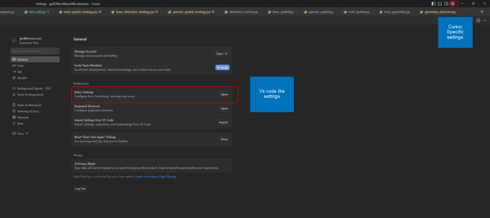

# Setting Up Cursor for pyRevit

Get started with Cursor AI for BIM development in just a few steps.

## 🔧 Prerequisites

Before setting up Cursor, ensure you have:

- **Development Environment**: Visual Studio 2022 for .NET/XAML Development or Python 3.8+ for standalone IFC processing
- **BIM Software**: Autodesk Revit 2020+ (for Revit API development)
- **pyRevit 5+** - Current stable release
- **Basic Knowledge**: Familiarity with Python 2/3, IronPython, basic libraries (pandas, numpy, matplotlib, openpyxl, ifcopenshell, etc.)
- **Version Control**: Git installed and configured

### Recommended Experience

- **C# Programming** - For advanced Revit API development
- **WPF/XAML** - For creating user interfaces
- **Database Concepts** - For data storage and retrieval
- **Version Control** - Git workflows and collaboration

## Install Cursor

1. **Download Cursor**: Visit [cursor.com](https://cursor.com) and download the installer
2. **Install**: Run the installer and follow the setup wizard
3. **Launch**: Open Cursor - AI features work immediately out of the box

## Configuration

### Sync Settings from VS Code

If you're migrating from VS Code, Cursor can automatically sync your settings:

1. **Import Settings**: `Ctrl+Shift+P` → "Import VS Code Extensions and Settings"
2. **Sign in** with your GitHub/Microsoft account to sync extensions and settings
3. **Select what to sync**: Extensions, Settings, Keybindings, Snippets

### Settings

Open Cursor settings (`Ctrl+,`) and configure:



*Cursor Settings panel showing various configuration options for optimizing your development environment*

### Install Cursor-Specific Extensions

:::warning Extension for Cursor
- for some reason, some time we cannot find exact extension in Cursor so let install in Vscode then transfer to Cursor
:::

**For C# Revit Development**:

- **C# Dev Kit** (by Microsoft) - Official C# Dev kit or **Reshaper** (by JetBrains) (choose 1 of them)
- **C#** (by Anysphere) - C# language support for Cursor
- **XAML Styler** - format XAML file

**For Python/pyRevit Development**:

- **Python** (by Anysphere) - Python language support for Cursor
- **Python Debugger** - Enhanced debugging capabilities
- **XAML Styler** - format XAML file
- **Ruff** - python linter

> **Important**: Use Cursor-specific versions of extensions when available. Standard VS Code extensions may not work properly or lack Cursor's AI integration features.

### Configure Python Stubs for python/Revit API

For enhanced Python development with Revit API and pyRevit, configure additional stub paths:

```json
{
    "cursorpyright.analysis.extraPaths": [
        "F:/path/to/pyRevitAutocomplete/common",
        "F:/path/to/pyRevitAutocomplete/2025",
        "F:/path/to/pyGTV/pyGTV.extension/lib",
        "F:/path/to/pyDCMvn/pyDCMvn.lib",
        "~/AppData/Roaming/pyRevit-Master/pyrevitlib",
        "~/AppData/Roaming/pyRevit-Master/site-packages",
        "~/AppData/Roaming/pyRevit/Extensions/pyDCMvn.lib"
    ]
}
```

> **Note**: Adjust paths according to your local development environment setup.

## Verify Installation

Test your setup with this simple prompt:

**Cursor Prompt**: *"Create a basic Revit external command structure with proper namespaces and error handling"*

If Cursor suggests appropriate Revit API imports and command structure with proper IntelliSense, you're ready to proceed!

## Next Steps

With Cursor installed and configured, continue with [Project Setup](./project-setup.md) to organize your BIM development environment and configure workspace-specific settings.

---


*Setup guide by [DCMvn CO., Ltd](https://dcmvn.com) - Digital Construction and Management*
