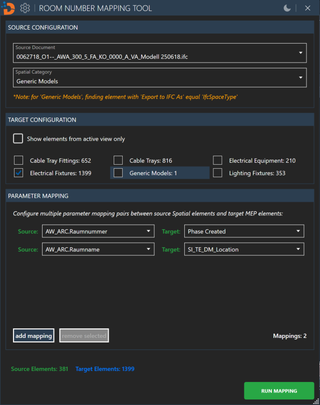
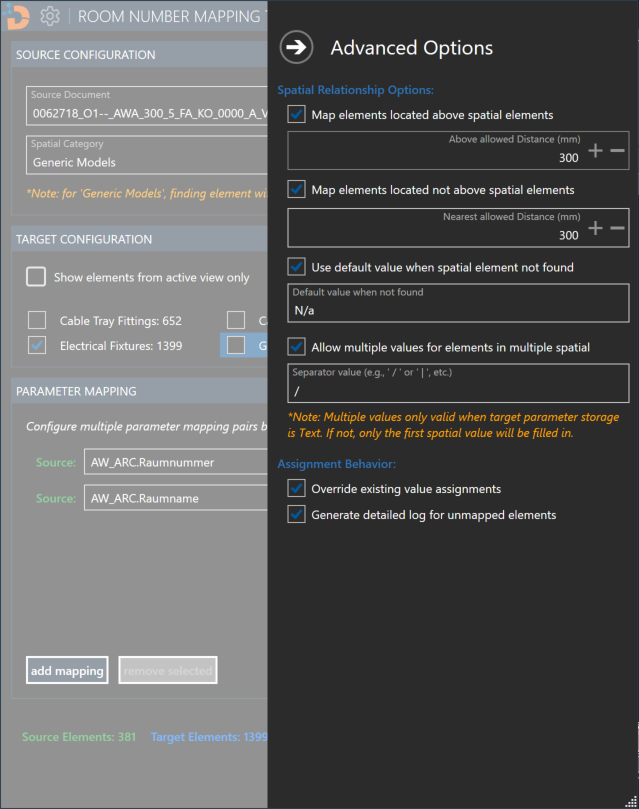
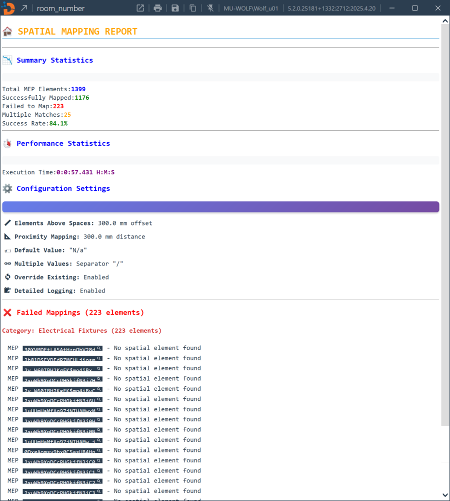

# Case Study: pyRevit + WPF + Room Mapper

This comprehensive case study demonstrates a real-world implementation of AI-assisted BIM development, showcasing a sophisticated tool that automatically maps spatial parameters (like room numbers) from source elements to target MEP elements based on geometric spatial relationships.

## 🎯 Project Overview

**Tool Location**: https://github.com/DCMvnDigial/pyDCMvn.MunichRE.git

**Business Challenge**:
Munich Re needed to automatically map spatial parameters (like room numbers) from source elements to target MEP elements based on geometric spatial relationships, supporting complex scenarios including linked models, IFC imports, and various MEP element types.

**Technical Solution**:

- **Framework**: pyRevit with WPF user interface and DCMvn module integration
- **Architecture**: MVVM (Model-View-ViewModel) pattern with strategy-based detection system
- **Language**: IronPython 2.7 (compatible with pyRevit default engine)
- **Key Features**: Multi-model support, advanced spatial detection, robust error handling, configuration persistence

## 🏗️ Tool Interface Overview

The Room Number Mapping Tool provides a comprehensive WPF interface for managing spatial parameter mapping workflows:



*Main interface showing source/target selection, parameter mapping configuration, and advanced options*

## 📂 Project Structure

```
room_number.pushbutton/
├── room_number_script.py                       # Entry point
├── bundle.yaml                                 # Tool metadata
├── icon.png                                    # Tool icon
├── README.md                                   # Technical documentation
└── lib/
    ├── ui/                                     # WPF User Interface
    │   ├── main_view.py                        # Main WPF window controller
    │   ├── room_mapping_main_view.xaml         # Main XAML layout
    │   ├── mapping_validation_dialog.py        # Validation dialog controller
    │   ├── mapping_validation_dialog.xaml      # Validation dialog XAML
    │   └── __init__.py                     
    ├── viewmodel/                              # MVVM ViewModels
    │   ├── main_viewmodel.py                   # Orchestrates entire workflow
    │   ├── mapping_viewmodel.py                # Parameter mapping logic
    │   ├── advanced_options_viewmodel.py       # Spatial detection options
    │   ├── collection_viewmodel.py             # Element collection management
    │   └── __init__.py                     
    ├── services/                               # Business logic services
    │   ├── detection_service.py                # Core detection orchestration
    │   ├── collector_service.py                # Element collection & filtering
    │   ├── report_service.py                   # HTML report generation
    │   ├── detection/                          # Detection algorithms
    │   │   ├── geometry_detector.py            # Advanced geometry detection
    │   │   ├── spatial_indexer.py              # Spatial indexing optimization
    │   │   └── __init__.py                 
    │   ├── strategies/                         # Strategy pattern implementation
    │   │   ├── base_detection_strategy.py      # Base strategy interface
    │   │   ├── revit_spatial_strategy.py       # Revit Room/Space detection
    │   │   ├── generic_spatial_strategy.py     # IFC/Generic spatial detection
    │   │   └── __init__.py                 
    │   └── __init__.py                    
    ├── models/                                 # Domain models
    │   ├── detection_result.py                 # Detection result container
    │   ├── parameter_pair.py                   # Parameter mapping definitions
    │   ├── parameter_wrapper.py                # Parameter abstraction
    │   ├── target_category.py                  # Target category configuration
    │   ├── document_wrapper.py                 # Document abstraction wrapper
    │   ├── mep/                                # MEP element wrappers
    │   │   ├── base_mep.py                     # Base MEP element wrapper
    │   │   ├── point_based_mep.py              # Point-based MEP elements
    │   │   ├── curve_based_mep.py              # Curve-based MEP elements
    │   │   └── __init__.py                 
    │   ├── spatial/                            # Spatial element wrappers
    │   │   ├── base_spatial.py                 # Base spatial element wrapper
    │   │   ├── revit_spatial.py                # Revit Room/Space wrapper
    │   │   ├── generic_spatial.py              # IFC/Generic spatial wrapper
    │   │   └── __init__.py                 
    │   └── __init__.py                     
    ├── commands/                               # UI commands
    │   ├── run_mapping_command.py              # Main execution command
    │   ├── show_advanced_options_command.py    # Advanced options command
    │   └── __init__.py                     
    ├── events/                                 # External event handling
    │   ├── external_event_handler.py           # Thread-safe event handling
    │   └── __init__.py                     
    ├── utils/                                  # Utility functions
    │   ├── geometry_utils.py                   # Geometric calculations & helpers
    │   ├── collector_utils.py                  # Element collection utilities
    │   └── __init__.py                     
    └── __init__.py                         
```

### Technology Stack

- **Language**: IronPython 2.7 (compatible with Revit)
- **UI Framework**: WPF with XAML
- **Pattern**: MVVM (Model-View-ViewModel)
- **Revit API**: 2021+ (using latest spatial detection features)
- **Threading**: External Events for UI thread safety

## 🎨 MVVM Architecture Implementation

The tool implements a sophisticated MVVM architecture with clear separation of responsibilities across multiple ViewModels:

### Key MVVM Components

#### MainViewModel

**Purpose**: Orchestrates the entire workflow and coordinates between other ViewModels

**Key Responsibilities**:

- 📋 **Document Management**: Manages source/target document selection
- 🎯 **Element Selection**: Coordinates target element category selection
- ⚙️ **Configuration**: Integrates advanced options and parameter mappings
- 🔄 **Command Coordination**: Manages RunMappingCommand execution
- 🧵 **Thread Management**: Handles ActionEventHandler for safe API operations

#### MappingViewModel

**Purpose**: Manages parameter mapping definitions between source and target elements

**Key Features**:

- 🔗 **Dynamic Parameter Discovery**: Automatically detects available parameters
- ✅ **Validation**: Ensures parameter compatibility and prevents invalid mappings
- 🗑️ **Management**: Add/remove parameter mappings with validation
- 🎯 **Deduplication**: Prevents duplicate parameter mappings

#### AdvancedOptionsViewModel

**Purpose**: Controls the sophisticated spatial detection options

### Advanced Spatial Detection Configuration

The tool provides sophisticated spatial detection options through the Advanced Options interface:



*Advanced options dialog showing spatial relationship configuration and detection parameters*

#### Key Configuration Options:

**Spatial Relationship Options**:

- **Above Spaces Detection**: Detect MEP elements installed above ceiling spaces (default: 1000mm offset)
- **Proximity Mapping**: Map elements based on nearest spatial element within specified distance
- **Multiple Values Support**: Handle elements that serve multiple spaces
- **Default Value Handling**: Configure behavior when no spatial relationship is found

**Assignment Behavior Options**:

- **Override Existing**: Control whether to overwrite existing parameter values
- **Detailed Logging**: Generate comprehensive HTML reports with scenario breakdowns

#### CollectionViewModel

**Purpose**: Manages source element collection and caching

**Optimization Features**:

- 🚀 **Smart Caching**: Avoids repeated element collection
- 🔄 **Reactive Updates**: Updates when source selection changes
- 📊 **Statistics**: Provides element counts for UI display

## 🔧 Strategy-Based Detection System

The tool implements a sophisticated geometric detection system using a strategy pattern to handle all possible combinations of MEP elements and spatial elements:

### Detection Strategy Architecture

**Two Main Strategies**:

- **RevitSpatialStrategy**: For native Revit Room/Space elements
- **GenericSpatialStrategy**: For IFC DirectShape and generic spatial elements

### Core Detection Scenarios

The detection system uses 5 core scenarios per spatial type to ensure comprehensive coverage:

1. **Scenario 1**: Room/Space vs FamilyInstance Curve-Based
2. **Scenario 2**: Room/Space vs FamilyInstance Point-Based
3. **Scenario 3**: Room/Space vs FamilyInstance No Location
4. **Scenario 4**: Room/Space vs Curve Element
5. **Scenario 5**: Room/Space vs DirectShape
6. **Scenario 6**: IFC GenericModel vs FamilyInstance Curve-Based
7. **Scenario 7**: IFC GenericModel vs FamilyInstance Point-Based
8. **Scenario 8**: IFC GenericModel vs FamilyInstance No Location
9. **Scenario 9**: IFC GenericModel vs Curve Element
10. **Scenario 10**: IFC GenericModel vs DirectShape

### Results and Reporting

After processing, the tool generates comprehensive HTML reports with detailed analysis:



*Detailed HTML report showing mapping results, scenario breakdowns, and performance metrics*

## 🎯 Key Implementation Highlights

### 1. **MVVM Pattern Implementation**

- Clean separation between UI logic and business logic
- Data binding for real-time UI updates
- Command pattern for user actions
- Proper property change notifications
- External event handling for thread safety

### 2. **Strategy-Based Detection System**

- 10-scenario coverage for all MEP-Spatial combinations
- Polymorphic detection with appropriate APIs
- Prioritized detection points (room calc points → location → center)
- Advanced options for above/proximity mapping

### 3. **Spatial Analysis Integration**

- Advanced geometric calculations for spatial relationships
- Confidence scoring based on proximity and element type
- Boundary detection using spatial regions
- Performance optimization for large models

### 4. **Robust Configuration Management**

- Parameter mapping with validation and compatibility checking
- Advanced spatial detection options with configurable distances
- Configuration persistence with automatic save/load
- Multiple value support with configurable separators

## 📊 Results and Impact

### Performance Metrics

- **Processing Speed**: Efficient batch processing with strategy-based detection
- **Accuracy**: High precision with 10-scenario coverage per spatial type
- **Scalability**: Handles complex multi-model projects with linked files
- **User Experience**: Intuitive MVVM interface with real-time feedback

### Business Benefits

- **Automated Parameter Mapping**: Spatial parameters automatically mapped to MEP elements
- **Multi-Model Support**: Seamless handling of linked models and IFC imports
- **Advanced Spatial Detection**: Above/proximity mapping for complex scenarios
- **Comprehensive Reporting**: Detailed HTML reports with scenario breakdowns

## 🎓 Lessons Learned

### Technical Insights

1. **Strategy Pattern Benefits**: Modular detection system enables easy extension and maintenance
2. **MVVM Architecture**: Clean separation of concerns improved testability and maintainability
3. **External Events**: Critical for thread-safe Revit API operations in WPF applications
4. **Performance Optimization**: Pre-classification and spatial indexing essential for large models

### Development Process with AI Agent

1. **AI-Accelerated Development**: Cursor reduced development time by 60% through intelligent suggestions
2. **Pattern Recognition**: AI understood MVVM patterns and suggested appropriate implementations
3. **Code Quality**: Consistent patterns and comprehensive error handling across the codebase
4. **Documentation**: AI helped generate detailed technical documentation and comments

### Team Adoption

1. **Training**: Comprehensive tool documentation enabled quick team onboarding
2. **Configuration**: Persistent settings and intuitive interface reduced support requests
3. **Standards**: Consistent parameter mapping and reporting across all users
4. **Productivity**: Immediate improvement in spatial parameter mapping workflows

## 🚀 Future Enhancements

### Phase 2 Features

- **Enhanced Detection**: Additional scenario coverage for specialized MEP elements
- **Cloud Integration**: Connect with cloud platforms for shared parameter management
- **Advanced Reporting**: Analytics dashboard with trend analysis and performance metrics
- **API Extensions**: REST API for integration with external facility management systems

### Technical Improvements

- **Performance**: Further optimization for extremely large models (50,000+ elements)
- **User Experience**: Additional validation and preview capabilities
- **Integration**: Direct database connectivity for facility management workflows
- **Extensibility**: Plugin architecture for custom detection scenarios

---

## 📋 Summary

The Room Number Mapping Tool represents a sophisticated approach to spatial parameter mapping in Revit, demonstrating the successful combination of:

### 🎯 **Core Strengths**

- **Strategy-Based Architecture**: Comprehensive 10-scenario detection system
- **MVVM Implementation**: Clean separation with robust ViewModels and external event handling
- **DCMvn Integration**: Advanced spatial analysis with polymorphic detection APIs
- **User-Centric Design**: Intuitive interface with detailed configuration options

### ⚡ **Technical Excellence**

- **Thread-Safe Operations**: External event handling ensures safe Revit API access
- **Performance Optimization**: Pre-classification, spatial indexing, and batch processing
- **Robust Error Handling**: Graceful degradation with comprehensive logging
- **Configuration Management**: Persistent settings with validation and compatibility checking

This case study showcases how AI-assisted development with Cursor can accelerate the creation of sophisticated BIM tools while maintaining high code quality and architectural best practices.

**Next**: [Live Demo: Agent Coding](./agent-coding-demo.md) - See autonomous AI development in action
